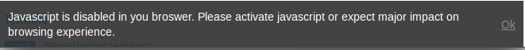

Extension Manual
=================

Description:
-----------
This extension will show a warning when a user visits the website without activated javascript.

Features:
-----------
1. Shows a warning on every entrance url
2. Sets a cookie when user accepted the warning, so that it will only be shown once
3. Redirects to the referrer page

Installation:
-----------
1. Install the extension.

2. Include Static Typoscript

3. Optional: Also include Basic Css

